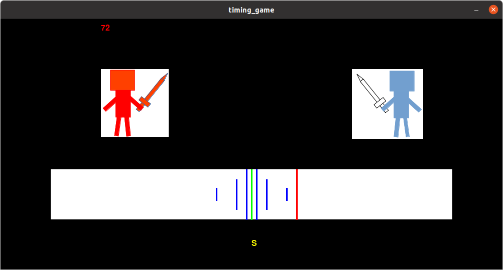

# タイミングゲーム

 
 Spaceキーを押すだけの単純なタイミングゲームです。
 Game A Weekの一環として、ゲームプログラミングの練習のために書きました。
 「2dgames.jpのゲーム専門学校」の「ゲームプログラミング初心者が
 作ると勉強になるゲーム20選」の実践をしようとしています。
 Pythonとそのゲーム用ライブラリであるPygameを利用しました。

## 利用した著作物
　甘茶の音楽工房より、「Texture Ⅰ」をBGMに使用しました。

## ref 
* 甘茶の音楽工房 
[https://amachamusic.chagasi.com/](https://amachamusic.chagasi.com/) 
* 2dgames.jpのゲーム専門学校、ゲームプログラミング初心者が作ると勉強になるゲーム20選 
[https://www.youtube.com/watch?v=fSTa05CTB3w](https://www.youtube.com/watch?v=fSTa05CTB3w)

